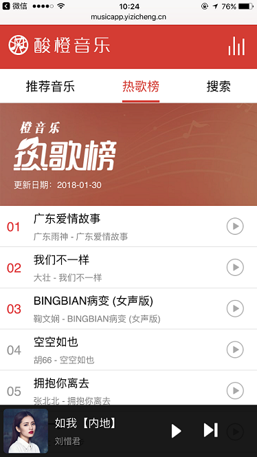
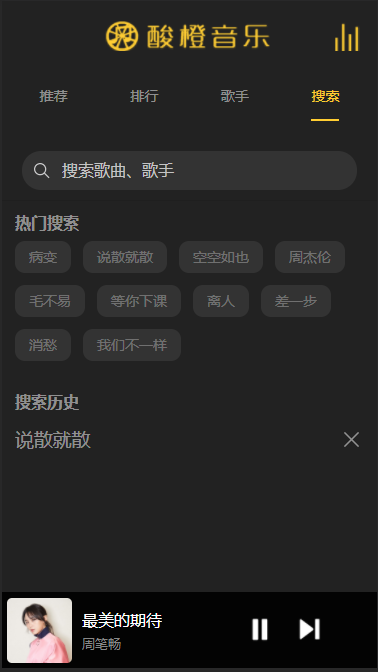

# 酸橙音乐-音乐播放器webapp

> vuejs写的一个仿照网易云音webapp的音乐播放器

## 截图

推荐音乐：


最新音乐：


热歌榜：



音乐搜索：


音乐播放页面：


#### 技术栈：

vue

vue-router

mint-ui


## 在线预览

[酸橙音乐](http://musicapp.yizicheng.cn)

扫码预览：




## 使用说明

``` bash
# install dependencies

npm install

# serve with hot reload at localhost:8080

npm run dev

# build for production with minification

npm run build

# build for production and view the bundle analyzer report

npm run build --report
```

For a detailed explanation on how things work, check out the [guide](http://vuejs-templates.github.io/webpack/) and [docs for vue-loader](http://vuejs.github.io/vue-loader).
